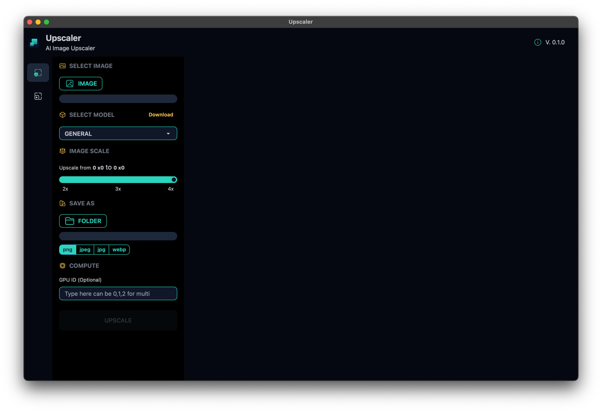
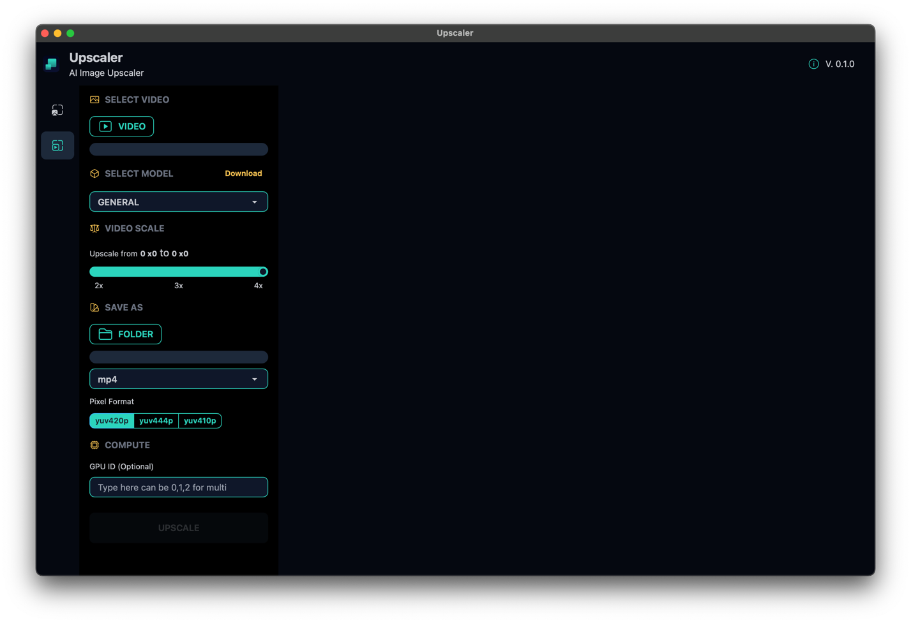

# AI-Upscaler

AI Image/Video Upscaler

## Features

- `Support for Multiple Upscale Sizes`: Provide support for upscaling in different sizes, including 2x, 3x, and 4x. Users can choose their preferred scaling factor for the process.

- `Image Upscaling`: Enable the enhancement of images through upscaling. This feature involves taking an original image and increasing its dimensions while preserving quality.

- `Video Upscaling`: Enhance video content by upscaling it. This functionality involves processing each frame of a video, increasing its resolution while maintaining the overall video quality.

Download the latest portable 
[Windows](https://github.com/prongbang/ai-upscaler/releases/tag/0.1.1) / 
[Linux](https://github.com/prongbang/ai-upscaler/releases/tag/0.1.1) / 
[MacOS](https://github.com/prongbang/ai-upscaler/releases/tag/0.1.1)
executable files.

### Upscale Image

### Upscale Video

