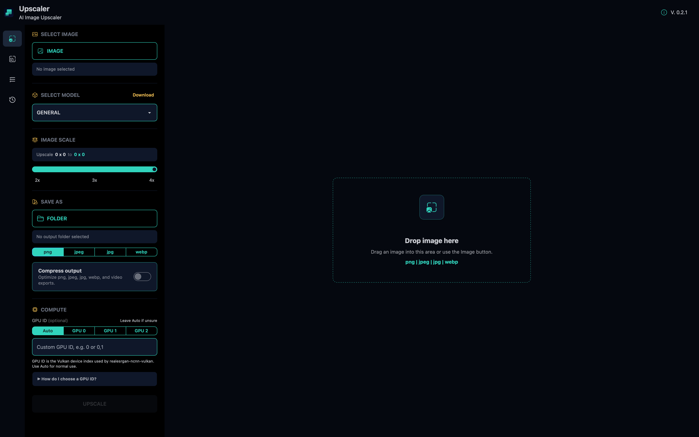
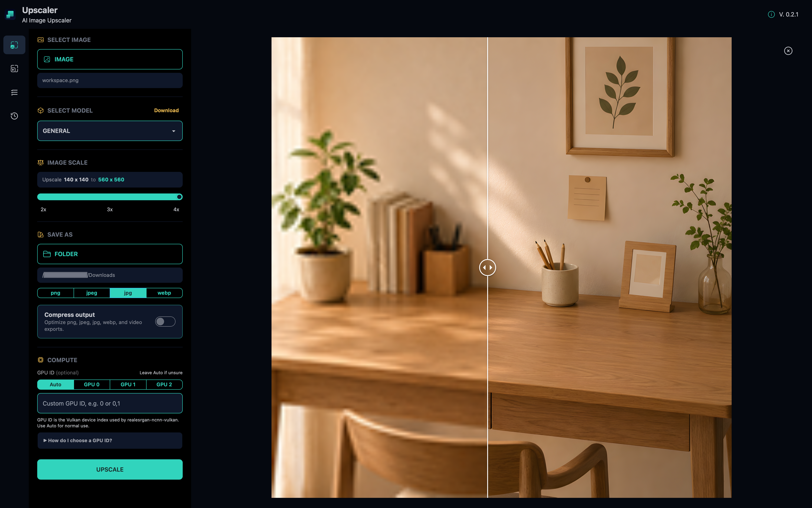
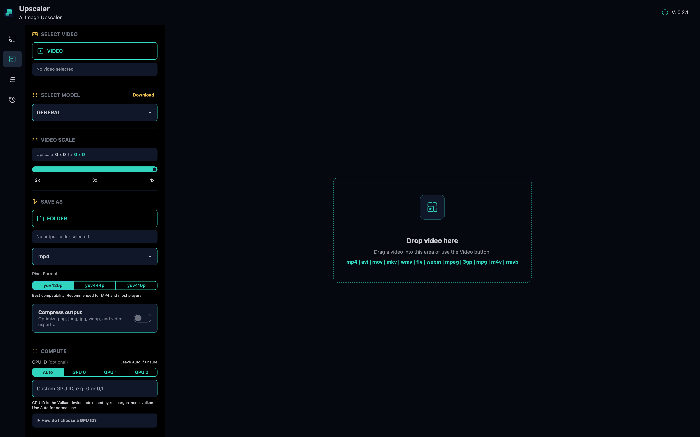
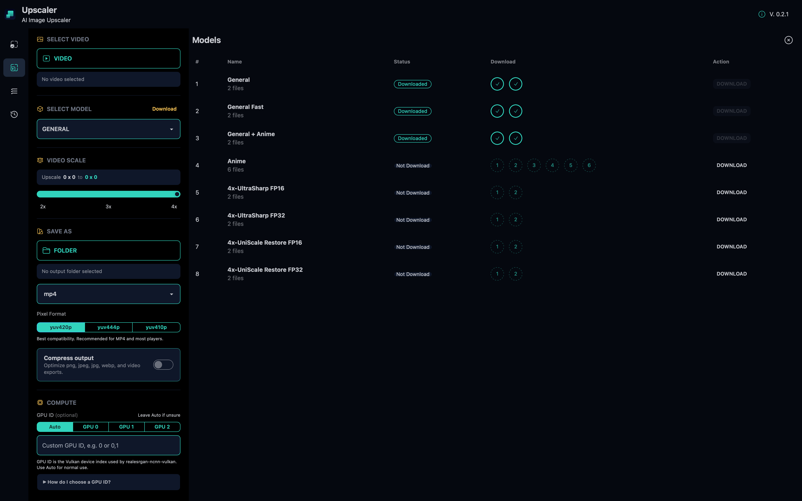
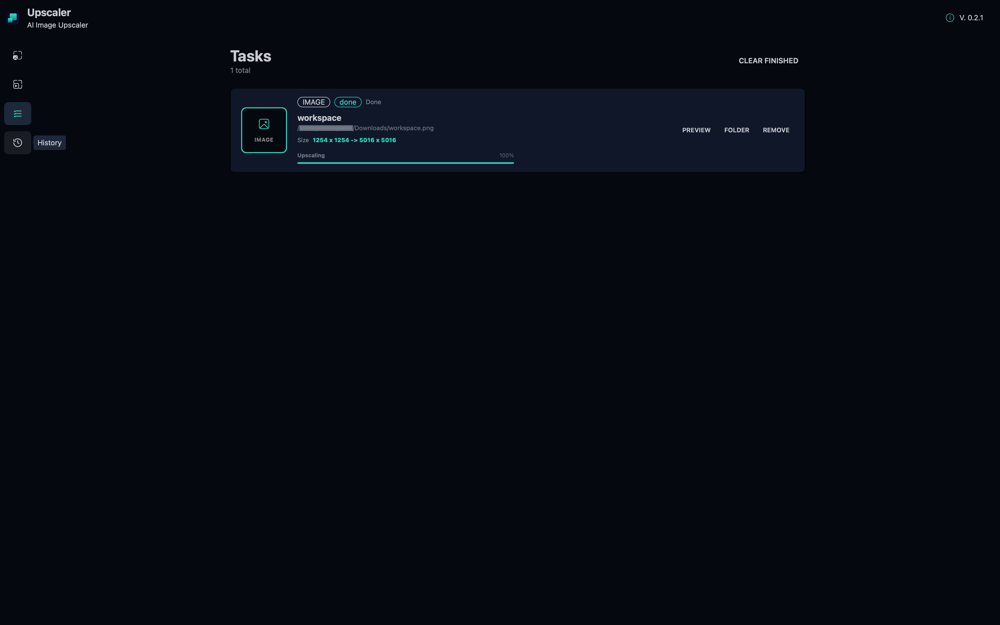
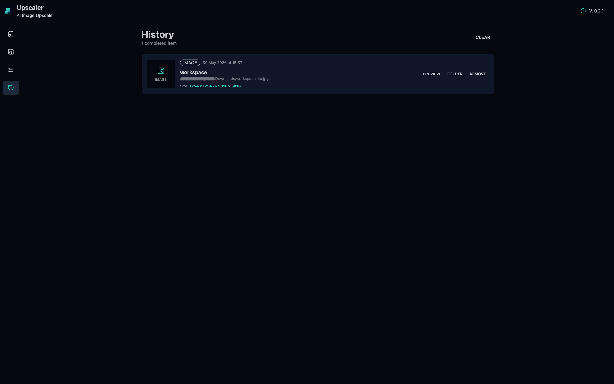

# 🚀 AI-Upscaler

> A powerful Image & Video Upscaler powered by Real-ESRGAN technology

## ✨ Features

- **Image Upscaling** - Enhance png, jpeg, jpg, and webp images with 2x, 3x, or 4x scaling
- **Video Upscaling** - Process videos frame-by-frame while preserving quality
- **Download Model Manager** - View installed model packs and download missing model files from the app
- **Task Queue** - Track active upscale jobs, progress, preview actions, output folders, and cleanup actions
- **History** - Review completed renders and reopen previews or output folders later
- **GPU Selection** - Choose Auto or a specific GPU ID for Vulkan-based processing
- **Output Controls** - Select output format, pixel format, and optional compression settings
- **Cross-Platform Support** - Available for Windows, Linux, and macOS

## 📥 Download

Get the latest portable executable files:

## 📷 Screenshots

### Image Selection

### Image Preview

### Video Upscaling

### Download Model

### Task Queue

### History

### Workflow 

## 🧠 Models

AI-Upscaler uses advanced neural network models to deliver exceptional results.

[Browse the Model Database](https://upscale.wiki/wiki/Model_Database) to learn more about the technology behind this tool.

## 💡 How It Works

AI-Upscaler leverages Real-ESRGAN (Enhanced Super-Resolution Generative Adversarial Networks) to intelligently enhance your media:

1. **Select** your image or video file
2. **Download** any missing model files when needed
3. **Configure** the model, upscale factor, GPU, output format, and compression settings
4. **Process** the media and monitor progress in Tasks
5. **Preview** the result or reopen completed renders from History

## 📄 License

This project is licensed under the MIT License - see the LICENSE file for details.

---
